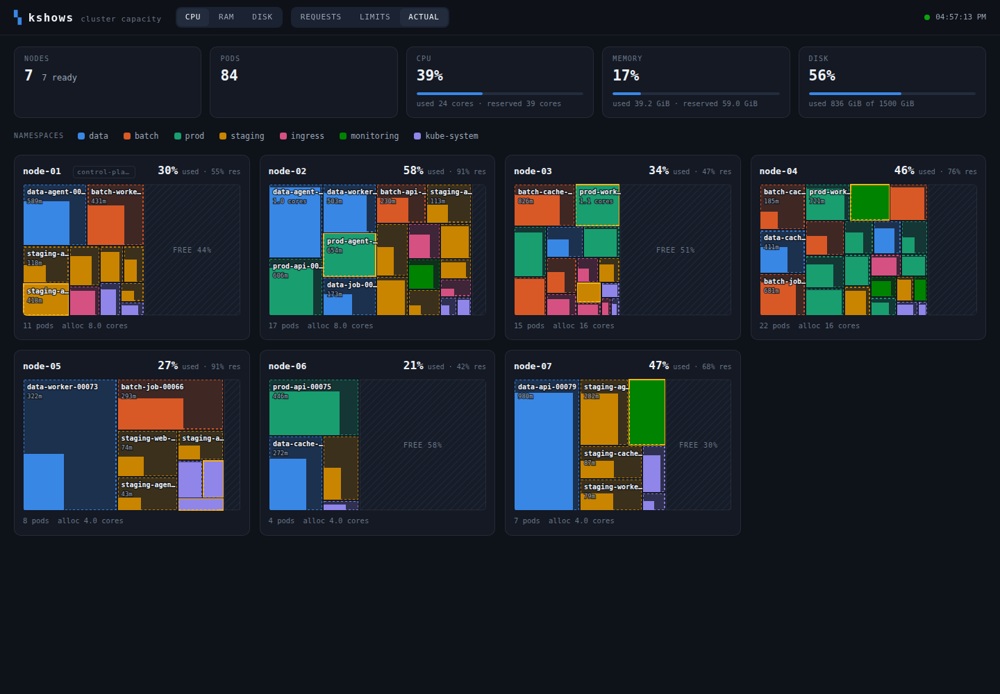
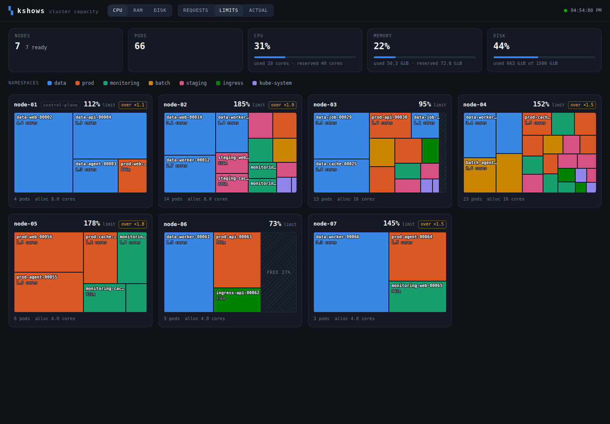
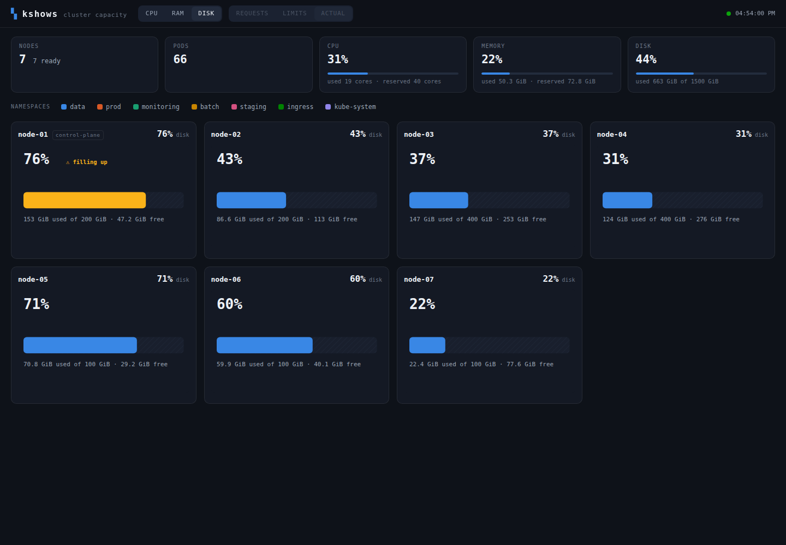
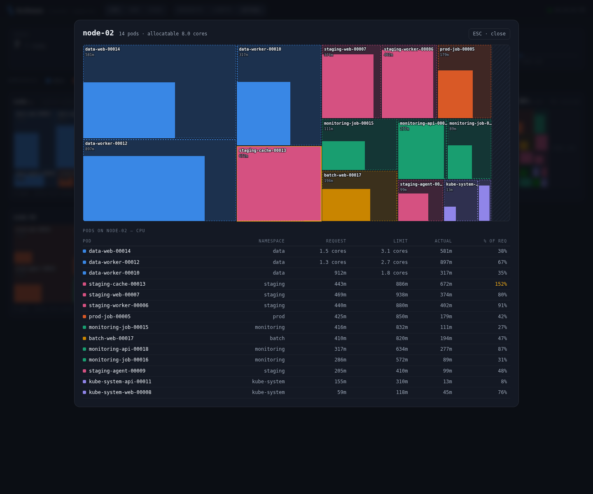

# kshows

[](https://github.com/tekikaito/kshows/actions/workflows/ci.yml)
[](https://goreportcard.com/report/github.com/tekikaito/kshows)
[](LICENSE)
[](https://github.com/tekikaito/kshows/releases)

**See your cluster the way the scheduler can't: as physical space.**

kshows draws every Kubernetes node as a rectangle and packs its pods inside,
sized by what they actually consume — not just what they asked for. One
glance tells you which nodes are full, which are idling, where the slack
hides, and which pod is about to blow past its reservation.



---

## Why another Kubernetes dashboard?

Every dashboard can chart CPU over time. Almost none can answer the question
an admin actually walks up with: **"how full are my machines, and is any of
that reservation real?"**

The tools that come closest each miss the mark: terminal-only and
AWS-locked, or requests-based only, or archived. Nothing maintained shows
*browser-based, proportional, usage-vs-reservation packing across CPU, RAM
and disk* on any conformant cluster. kshows is that tool.

|  | kshows |
|---|---|
| **Requests *and* actual usage** | Both, in one block — the dashed outline is the reservation, the solid fill is reality. The gap between them is your money. |
| **Disk as a first-class dimension** | Node-level used-vs-free with warning thresholds, straight from the kubelet. Nobody else draws disk spatially. |
| **Cloud-agnostic** | Pure Kubernetes APIs. on-prem, bare-metal, k3s, GKE, EKS, AKS — if it's conformant, it works. |
| **Read-only, forever** | The ClusterRole contains zero write verbs. There is no write code path to audit, because there isn't one. |
| **One small binary** | Go backend + embedded zero-dependency UI. Distroless image, ~64 MiB memory request. |

## The signature view

Toggle to **ACTUAL** and every pod block becomes two encodings at once:

- **dashed outline** — what the pod *requested* (its reservation)
- **solid fill** — what it's *using right now*, anchored bottom-left so
  blocks read like filling containers
- **amber flag** — pods bursting past their request (your OOM-kill and
  eviction candidates)
- **hatched region** — genuinely unallocated space on the node

Over-provisioned teams show up as big dashed boxes with tiny fills.
Under-provisioned ones show up amber. Both are visible from across the room.

## More than one honest answer

"How full is this node?" has three legitimate answers, and tools that pick
one silently are lying to you. kshows makes the choice explicit:

| Toggle | Blocks sized by | What it tells you |
|---|---|---|
| **REQUESTS** | scheduler reservations | what the scheduler believes |
| **LIMITS** | declared ceilings | worst-case commitment (`over ×N` badges when a node is overcommitted) |
| **ACTUAL** | live usage vs. request | the truth, and the gap |



Disk gets its own dimension — node-level fill with 75% / 90% thresholds:



Click any node to drill in: a full-size treemap plus a sortable pod table
with request, limit, actual, and %-of-request per pod.



## Quickstart

**Helm (in-cluster, recommended):**

```sh
helm install kshows oci://ghcr.io/tekikaito/charts/kshows \
  --namespace kshows --create-namespace

kubectl -n kshows port-forward svc/kshows 8080:80
# open http://localhost:8080
```

If your cluster restricts the kubelet proxy or has no Metrics Server, turn the
matching permission off — kshows narrows the UI instead of failing:
`--set rbac.nodesProxy=false`, `--set rbac.metrics=false`. See the
[chart README](charts/kshows/README.md) for all values.

**Plain manifests**, if you'd rather not use Helm:

```sh
kubectl apply -f https://github.com/tekikaito/kshows/releases/latest/download/rbac.yaml
kubectl apply -f https://github.com/tekikaito/kshows/releases/latest/download/deployment.yaml
kubectl -n kshows port-forward svc/kshows 8080:80
```

Read them before applying — you should for anything that gets a ClusterRole.
They create a namespace, a ServiceAccount, a read-only ClusterRole, a
1-replica Deployment, and a ClusterIP Service. Images are published to
`ghcr.io/tekikaito/kshows`.

**Local, against your kubeconfig:**

```sh
go build -o bin/kshows ./cmd/kshows
./bin/kshows            # uses ~/.kube/config — credential source is the only difference
```

**No cluster handy?**

```sh
./bin/kshows --mock     # simulated cluster with drifting usage
```

Live updates stream over SSE every 15s; blocks are keyed by pod UID, so
changes animate instead of flickering. Views are shareable URLs:
`/?dim=mem&metric=actual&node=worker-3`.

## Degrades gracefully, by design

kshows probes what your cluster can provide and never fakes the rest:

| Missing | What you get instead |
|---|---|
| Metrics Server | requests/limits view + a banner; ACTUAL is disabled, never zeroed |
| `nodes/proxy` access | disk shows capacity-only with a note |
| Cluster-wide read (local mode) | whatever your own RBAC can see |

## What it reads (and all it can do)

| Signal | Source | RBAC |
|---|---|---|
| Node capacity | `Node.status.allocatable` | `nodes: get,list,watch` |
| Pod requests/limits | pod spec (incl. init/sidecar semantics) | `pods: get,list,watch` |
| Live CPU/RAM | Metrics Server (`metrics.k8s.io`) | `nodes,pods: get,list` |
| Node disk | kubelet Summary API via apiserver proxy | `nodes/proxy: get` |

Nodes and pods come from shared informer caches — no cluster-wide re-listing
per poll, cheap even on large clusters. Disk fan-out runs on a slower 60s
cadence with bounded concurrency.

## API

The UI is just a client. Build your own on the same endpoints:

- `GET /api/v1/snapshot` — the full model as JSON
- `GET /api/v1/stream` — SSE snapshots every poll interval
- `GET /api/v1/capabilities` — which signals are live
- `GET /metrics` — Prometheus metrics (see below)
- `GET /healthz` / `GET /readyz`

## Observability

`/metrics` reports **how kshows is doing its job** — not what it found. Pod
security annotations for scraping are already on the Deployment.

| Metric | Why you'd alert on it |
|---|---|
| `kshows_capability{signal}` | 1 when a signal is live, 0 when degraded. Catches a cluster that has silently lost the disk or usage dimension. |
| `kshows_snapshot_timestamp_seconds` | Subtract from `now()` for staleness — the collector stopped producing snapshots. |
| `kshows_poll_duration_seconds` | Polls creeping toward the 15s interval means the cluster has outgrown the poll budget. |
| `kshows_poll_total{result}` | Polls that produced no snapshot at all. |
| `kshows_signal_requests_total{signal,result}` | `absent` is definitive (not installed / forbidden); `error` is transient and subject to hysteresis. |
| `kshows_stream_clients` | Connected SSE clients. A count that never returns to zero means the stream handler is leaking. |

Plus the standard Go runtime and process collectors.

**Cluster capacity is deliberately not exported here.** Per-node and per-pod
series are [kube-state-metrics'](https://github.com/kubernetes/kube-state-metrics)
job; duplicating them would explode label cardinality on large clusters and
copy your workload names into a second system. Every series above is
fixed-cardinality, and no node or pod name appears in any label — there's a
test that enforces it.

## Development

```sh
make build      # binary at bin/kshows
make test       # Go tests + treemap layout math tests
make run-mock   # hack on the UI against simulated data
make image      # distroless container image
```

Frontend is plain ES modules + SVG (no framework, no build step), embedded
into the binary. The squarified-treemap layout is pure math behind a
renderer-agnostic interface — a Canvas renderer for thousand-node clusters
can drop in without touching layout or data code.

## Scope (v1)

Live, point-in-time, read-only. Deliberately **not** included: history and
trends, per-pod disk / PV attribution, cost allocation, rightsizing
recommendations, multi-cluster, write operations (that one's permanent).

## Contributing & security

Contributions are welcome — see [CONTRIBUTING.md](CONTRIBUTING.md) for the
development loop and the one non-negotiable rule (kshows stays read-only).

For the security posture, what kshows can read, and how to report a
vulnerability privately, see [SECURITY.md](SECURITY.md). One thing worth
repeating here: **kshows has no built-in end-user authentication.** Anyone who
can reach the port sees your whole node and pod inventory, so if you expose it
beyond `port-forward`, put auth in front of it.

## License

[Apache License 2.0](LICENSE) — see [NOTICE](NOTICE).
